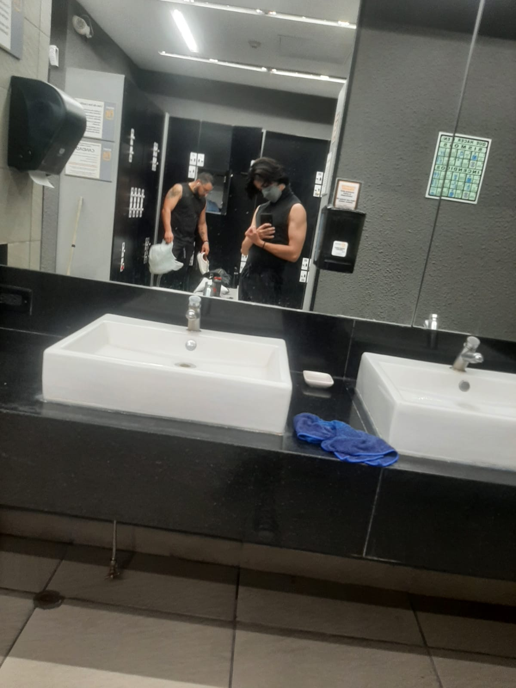

## Datos

- Mi nombre es _**Sergio Santiago Salazar Ramírez**_.

- Tengo _**20 años**_, nací el 5 de mayo de 2003.

- mido _**1.65cm**_.

- la verdad no se cuanto peso, pero una vez me equilibraron con 3 mochilas llenas.

foto mía de cuando iba al gimnacio 

---
## Presentación
Como ya dije antes, me llamo Sergio Santiago Salazar Ramírez, tengo 20 años y nací el 5 de mayo de 2003, hasta ahora, he cursado la preparatoria y me encuentro estudiando la carrerra.

A lo largo de mi vida he entrenado:
- natación
- karate
- futbol
- taekwondo
- gimnasia
- acabo de entrar a box

En general suelo ser un poco especial con la comida, ya que, en general me gusta la comida fácil de preparar y con pocos ingredientes, no me gusta que me vean comer ni dormir.

---
## Descripción

Elegí la carrera que estudio (Desarrollo de software interactvo y videojuegos) por varias razones, pero las más especiales son 2, la primera es porque siempre me han gustado los videojuegos y me interesaba saber como se hacían y todos los desarrollos que llevan detrás y la segunda es porque siendo honesto, me había tomado un año sabático y ya necesitaba estudiar algo, pero en general me gusta la carrera que terminé eligiendo, aunque hay veces en las que dudo si elegí bien.

Espero que al salir de la carrera pueda encontrar algún trabajo que me haga sentir bien, me guste y pague bien para poder vivir, pero en caso de que no sea así, probablemente termine estudiando algo y sea profesor en alguna escuela.

--- 
## Pasatiempos

Por lo general en mis tiempos libres suelo:
- ver videos.
- jugar videojuegos.
- de vez en cuando me gusta leer algo.
- salir a caminar.
- muy de vez en cuando escucho música.
- acabo de inscribirme a box, así que probablemente en eso se pase grán parte de mi tiempo libre ahora.

Aunque en general no suelo hacer mucho, el tiempo se pasa rápido.

---
## Métodos de contacto

Mi correo es: _**sssr308a@gmail.com**_

Mi número es: _**55 7854 2404**_

Me pueden encontrar en instagram como: _**sergio.salazarr**_

---
[práctica_3](https://github.com/sssrcv/practica3)

[práctica_5](/práctica%205.md)

[práctica_6](https://github.com/sssrcv/pr-ctica-6)